# HTML INPUT

## Introducción.

El elemento `<input>` en `HTML` es fundamental para la creación de formularios *WEB*, ya que permite a los usuarios ingresar datos que luego pueden ser procesados por el sitio. A través de este elemento se pueden generar diferentes tipos de campos, como cajas de texto, botones, casillas de verificación, selectores de fecha, entre otros. Su versatilidad lo convierte en una herramienta clave para la interración entre el usuario y l página *WEB*, ya que se adapta a distintas necesidades de entrada de información.

## Tipos de input, ejemplos y difentes usos.

## text

Existen distintos tipos de `input`, cada uno con usos específicos y ejemplos particulares. El primero que vamos a utilizar es el tipo texto `type="text"`, que es el más común y ampliamente utilizado en formularios. A continuación, se muestra un ejemplo de cómo se emplea esta etiqueta en el código `HTML`

**Ejemplo:**

```HTML
<body>

    <input type="text">

</body>
```

Como podemos ver, la etiqueta `input` es un elemento visual, por lo que debe colocarse dentro del `body` de la página *WEB*. Para utilizarla, se comienza con el símbolo menor que `<` seguido de la palabra `input`, formando `<input`. Luego, se añade el atributo `type="text"` para indicar que el campo será de tipo texto. De esta manera, la etiqueta completa queda escrita así: `<input type="text>"`.

A continuación, observaremos qué muestra la etiqueta `input` al ser incorporada en nuestra página.

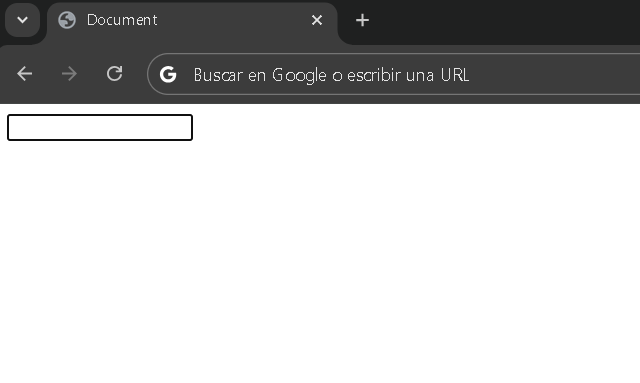

En nuestra página veremos un cuadro vacío en el que podremos escribir una palabra o cualquier tipo de texto.

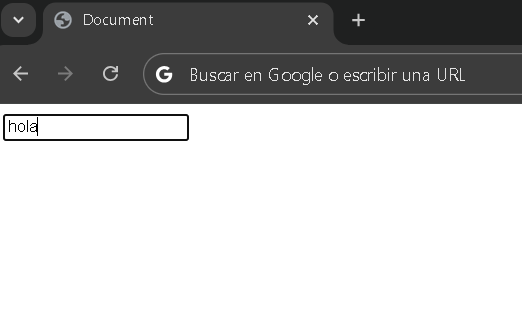

Bien, A continuación le asignaremos una etiqueta descriptiva `label` y un nombre a nuestro elemento `input`. Para ello, abriremos la etiqueta `label` y dentro escribiremos el texto `Nombre`. Luego, completaremos nuestro `input` agregándole el atributo `id="dato"`, lo que significa que estamos nombrando a esta etiqueta como `dato`. A continuación. veamos una imagen de ejemplo que ilustra esto.

```HTML
<body>
    <label for="texto">Nombre: </label>
    <input type="text"  id="texto">
</body>
```
Veamos el avance en nuestro documento:

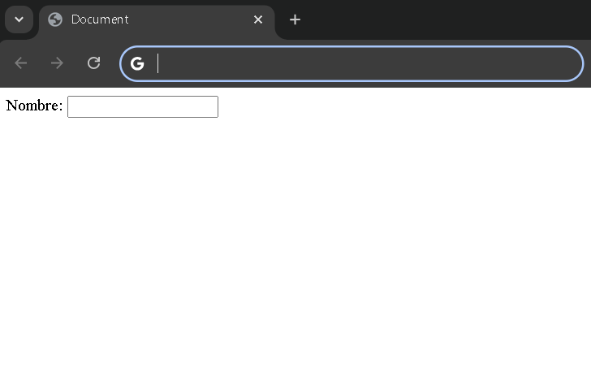</img>

Como podemos observar, la etiqueta `label` se muestra en pantalla con el texto *Nombre:*. Por otro lado, el atributo `name` no genra ningún cambio visual en el documento, ya que su función no está relacionada con la apariencia. Este atributo se encarga de asignar un nombre al campo `input`, lo cual es fundamental para que los datos se puedan identificar correctamente al ser enviados y, además, contribuye a que los motores de búsqueda no penalicen nuestro posicionamiento en el **S.E.O**.

**SEO** significa *Search Engine Optimization* (Optimización parar Motores de Búsqueda). Consiste en un conjunto de estrategias y técnicas aplicadas a un documento con el objetivo de mejorar su posicionamiento y lograr que aparezca de forma orgánica en los resultados en buscadores como `Google`, `Yahoo` o `YouTube`.

A continuación, vamos a vincular nuetra etique `label` con el campo `input` utilizando el atributo `id=""`. De esta manera, al hacer clic sobre texto del `label`, el cursor se posicinará automáticamente en el campo de entrada correspondiente.

A continuación se muestra una imagen de ejemplo:

```HTML
<body>
    <label for="texto">Nombre: </label>
        <input type="text" name="" id="texto">
   
</body>
```

En este ejemplo, podemos observar que el `input` utilizamos el atributo `id=""` con la identificación `texto`, y en el `label` utilizamos el atributo `for` para hacer referencia a ese mismo `id` con la palabra `texto`.

## email.

Ahora vamos a trabajar con otro tipo de elemento `input`, específicamente el de tipo `Email`. Su uso es muy similar al del tipo `text`; la principal diferencia es que cambiaremos el atributo `type="text"` por `type="email"`. También actualizaremos los atributos `name` e `id`, y crearemos una nueva etiqueta `label` asociada a este campo de tipo email. A continuación, observaremos el ejemplo en el siguiente código:

```HTML
    <body>
        <label for="texto">Nombre: </label>
        <input type="text" name="dato" id="texto">
        <label for="email">Email: </label>
        <input type="email" name="email" id="email">
    </body>
```
Se ha agregado un nuevo elemento `input` adicional al ya existente. Este nuevo campo tiene el atributo `type="email"`, con `name="email"` e `id="email"`. Asimismo, se ha creado una nueva etiqueda `label` asociada a este campo, utilizando el atributo `for="email"` para vincularla correctamente con el `input`.

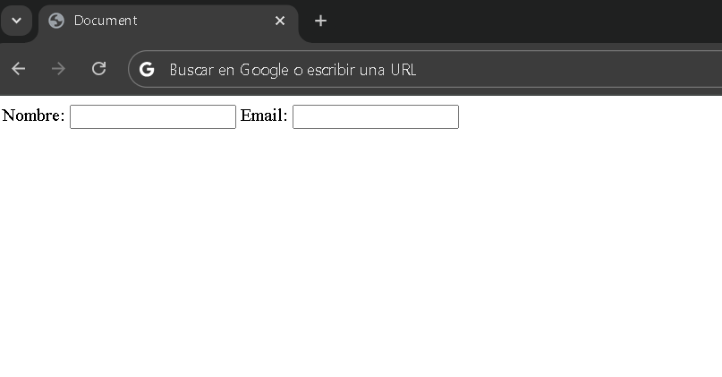

**¿Qué hace especial a este último campo de entrada?** 

Lo interesante es que, al tener el tipo `email`, si el usuario ingresa un valor que no cumple con el formato de una dirección de correo electrónico y se intenta enviar el formulario mediante un botón `submit`, el navegador mostrará automáticamente un mensaje de error.

**¿Qué es un formulario y qué significa `submit`?**

Un formulario es un documento, ya sea en formato físico o digital, diseñado para que el usuario ingresa datos estructurados `Como nombre, apellido o dirección`. En campos específicos. Estos datos luego pueden ser almacenados y procesados según se requiera.

Por otro lado, *submit*, que en español signifca `enviar` o `entregar`, hace referencia en el contexto de los formularios web a la acción de enviar los datos que el usuario ha completado, para que sean procesados o guardados por el sistema.

## `form`

Al crear un formulario en `HTML`, todos los elementos que lo componen deben estar contenidos dentro de la etiqueta `form`, que actúa como contenedor principal del formulario.

```HTML
<body>
    <form>
        <label for="texto">Nombre: </label>
        <input type="text" name="dato" id="texto">
        <label for="email">Email: </label>
        <input type="email" name="email" id="email">
    </form>
</body>
```
## submit

La siguiente etiqueta `input` que exploraremos es la de tipo `submit`. Para implementarla, crearemos un nuevo elemento `input` y esta vez le asignamremos el atributo `type="submit"`. Veamos qué ocurre al hacerlo.

```HTML
<body>
    <form>
        <label for="texto">Nombre: </label>
        <input type="text" name="dato" id="texto">
        <label for="email">Email: </label>
        <input type="email" name="email" id="email">
        <input type="submit">
    </form>
</body>
```

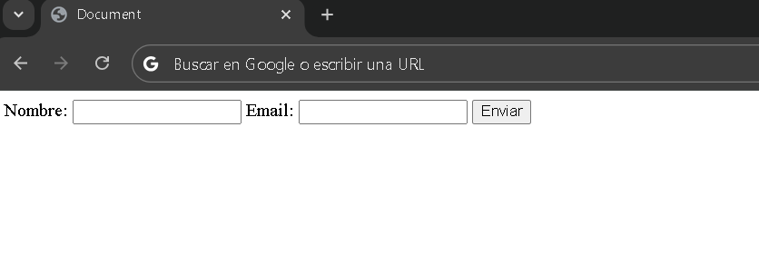

Como podemos ver, aparece un `boton` con la etiqueta `Enviar`. Este botón tiene la función de enviar la información ingresada en el formulario. En este punto, si introducimos un valor en el campo de correro electrónico (es decir, el `input` de tipo `email`) que no cumple con el formato válido, el navegador nos mostrará un mensaje de error. Veamos qué tipo de mensaje se presenta en este caso.

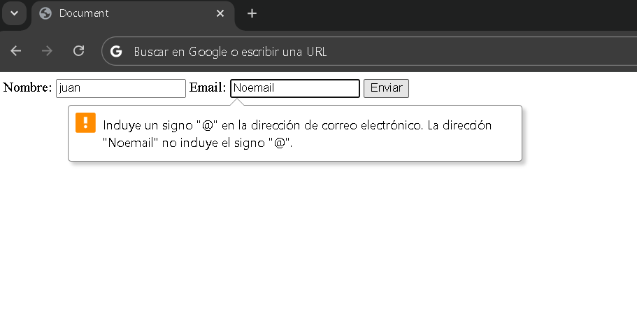

Se muestra un mensaje que indica: **Incluye un signo `@` en la dirección de correo electrónico. La dirección `Noemail` no incluye el signo `@`**. Para corregir este error, agregaremos el símbolo `@` a la dirección ingresada y observaremos qué sucede a continuación.

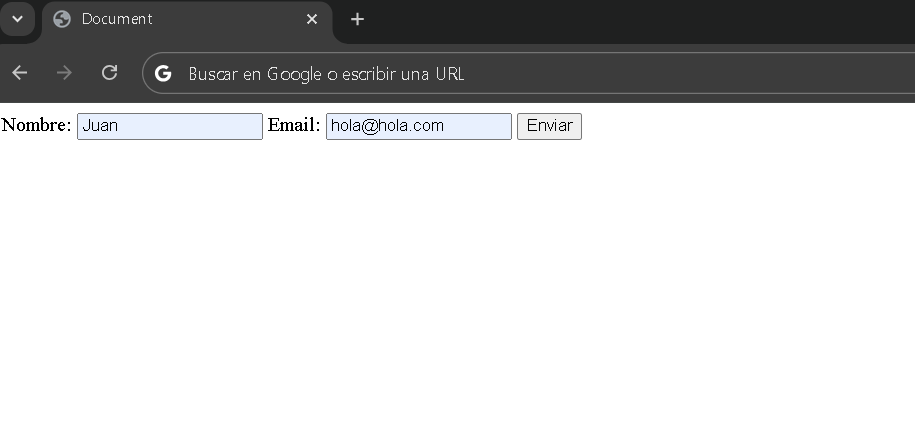

Presionaremos enviar y verificaremos que el contenido de los campos de entrada se envíe correctamente.

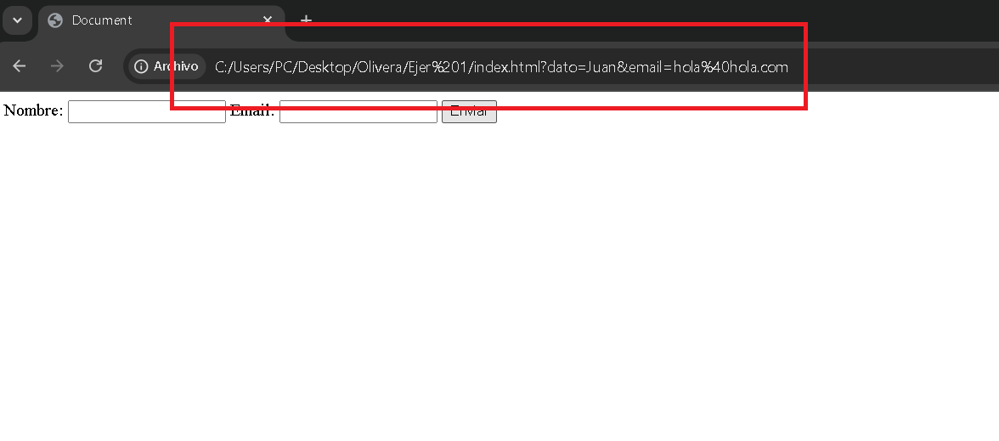

Efectivamente, al cumplir únicamente con la estructura de un correo electrónico, este `input` se enviara.

**¿Cómo podemos cambiar la palabra `enviar` en el botón de envío por otra, como `aceptar`?**

Para realizar este cambio, en el elemento `input` de tipo `submit` debemos agregar el atributo `value` y escribir dentro de él la palabra deseada, como por ejemplo `aceptar`. De esta forma, podremos personalizar el texto que aparece en el botón de envío según nuestras preferencias.

```HTML
    <input type="submit" value="aceptar">
```
Veamos el cambio en la página:

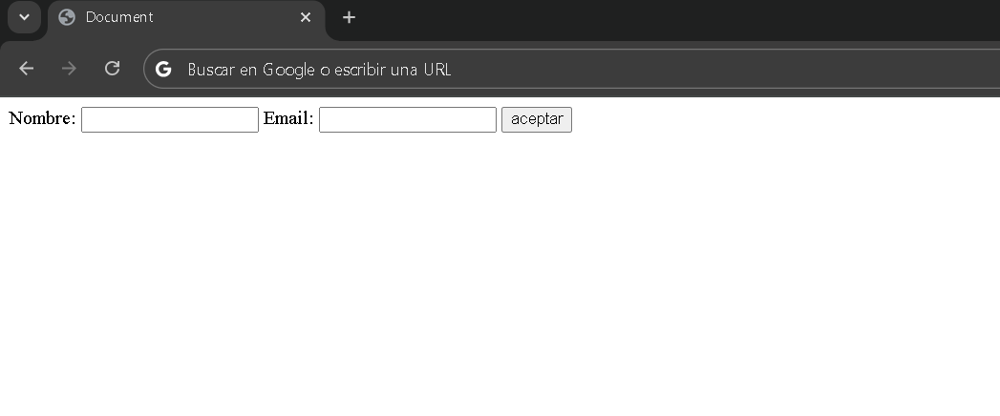

## password.

La siguiente etiqueta `input` será de tipo `password`. Para implementarla, debemos crear un nuevo `input` con el atributo `type` establecido en `password`. Además, asignaremos un nombre `name` a este campo, por ejemplo: `contraseña`. También crearemos una etiqueta `label` con el texto `Ingrese su contraseña: ` y un atributo `for` con la declaración `contra` para asociarlo con el `input`. Para que esta asociación funcione, el `input` debe tener un atributo `id` con la declaración `contra`. A continuación, veamos un ejemplo en el siguiente código:

```HTML
    <label for="contra"> Ingrese su contraseña: </label>
        <input type="password" name="contraseña" id="contra">
```
 
Veamos como el `input` de tipo `password` en el documento:

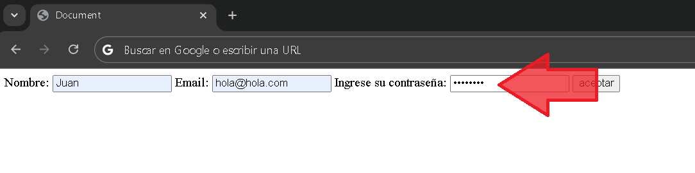

La etiqueta de tipo `password` es útil porque oculta los caracteres que escribimos, mostrando puntos en su lugar para proteger la privacidad de la contraseña.

Continuemos con el siguiente tipo de `input`, que es el tipo `radio`. Para crear este `input`, utilizaremos el atributo `type` con la declaración `radio`, quedando de la siguiente manera: `<input type="radio">`. Además, crearemos un `label` mediante el atributo `id` en el `input`, cuya declaración será `roj`, y el atributo `for` en el `label`, con la misma decleración `roj`.

Veamos la codificación:

``` HTML
    <label for="roj">Rojo: </label>
        <input type="radio" id="roj">
```

Veamos el resultado en el documento:

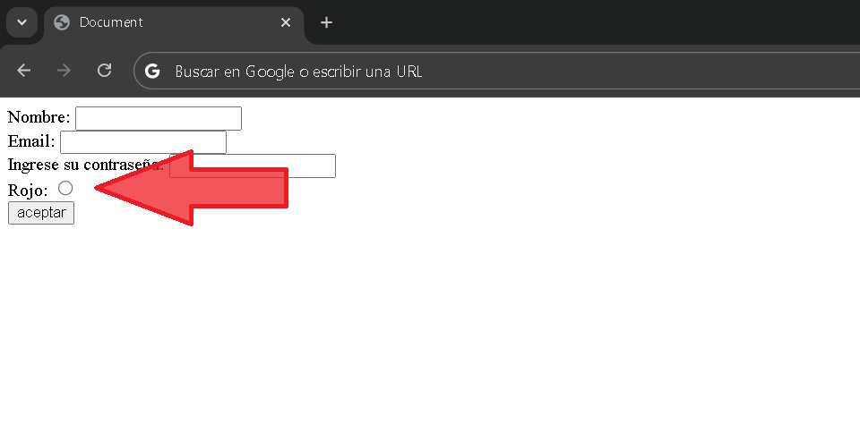

Como podemos observar, tenemos un `label` que dice `Rojo: `, seguido de un circulo que nos permite realizar una selección.

Normalmente, no se utiliza un solo botón de radio, ya que este tipo de `input` sirve para elegir entre varias opciones. Con solo una opción, no podemos distinguir claramente su propósito. Para resolver esto, crearemos dos botones de radio adcionales y continuaremos trabajando con ellos.

Crearemos un `input` de tipo radio para el color azul y otro para el color verde. A continuacion  codificación de ejemplo, y mostraremos cómo crear estos dos inputs de radio adicionales.

```HTML
        <label for="roj">Rojo: </label>
        <input type="radio" id="roj"> 
        <br>
        <label for="azu">Azul: </label>
        <input type="radio" id="azu">
        <br>
        <label for="ver">Verde: </label>
        <input type="radio" id="ver">
        <br>
```

Veamos el resultado en el documento:

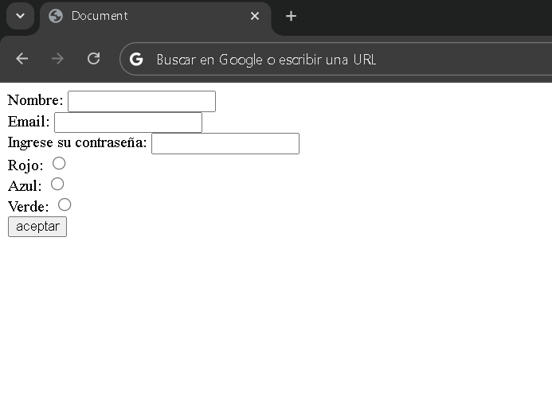

Es importante añadir un detalle clave a nuestras etiquetas `input` de tipo radio: Necesitamos especificar el valor que se enviará cuando cada opción esté seleccionada. Por ejemplo, si elegimos el color rojo, queremos que se devuelva el valor `red`, si seleccionamos azul, debe devolver `blue`, y si optamos por verde, el valor será `green`.

Para lograr esto, debemos agregar un atributo adicional a cada etiqueta `input` de tipo radio, llamado `value`. Para el color rojo, asignaremos `value="red"`, para el azul, `value="blue"`, y para el verde, `value="green"`.

Además, es fundamental que todas las opciones de radio compartan el mismo `name`. En este caso, nombramos todo los `input` de tipo radio como `inputRadio`.

Esta configuración nos permitirá seleccionar una opción y obtener ek vakir asociado cuando se envie el formulario. A continuación, asegurémonos de aplicar correctamente estos cambios en nuestras etiquetas de input radio.

```HTML
     <label for="roj">Rojo: </label>
        <input type="radio" id="roj" name="inputRadio"> 
        <br>
        <label for="azu">Azul: </label>
        <input type="radio" id="azu" name="inputRadio">
        <br>
        <label for="ver">Verde: </label>
        <input type="radio" id="ver" name="inputRadio">
        <br>
```

**¿Por qué damos el mismo nombre a todos los `input` de tipo radio?**

Lo hacemos para indicar que pertenecen a un conjunto de opciones. Al asignarle el mismo nombre `name`, estamos especificando que solo se puede seleccionar una opción a la vez dentro de este grupo. Si no les asignamos el mismo nombre, existiría la posibilidad de marcar todas lass opciones simultáneamente, lo cual no es comportamiento esperado para un conjunto de botonos de radio.

<video src="Videos/video1.mp4" controls=""></video>

**Input radio sin el mismo `name`**

*Codificación*:

```HTML
<label for="roj">Rojo: </label>
        <input type="radio" id="roj"> 
        <br>
        <label for="azu">Azul: </label>
        <input type="radio" id="azu">
        <br>
        <label for="ver">Verde: </label>
        <input type="radio" id="ver">
        <br>
```

*Video de ejemplo*:

<video src="Videos/video2.mp4" controls=""></video>

Este última forma de utilizar el `input` de tipo `radio` no es la más común para este propósito, ya que existe un tipo específico de `input` diseñado para manejar este tipo de selección: el **checkbox** `<input type="checkbox">`. El uso de un checkbox es muy similar al de un radio, pero con una diferencia fundamental en su funcionalidad.

En el caso de los checkbox, el `name` de cada `input` checkbox debe ser único e independiente entre ellos. Esto significa que cada checkbox, como el checkbox para el color rojo, debe tener un nombre único, como `rojo`, `red` o cualquier otro nombre distinto para diferenciarlo de los demás checkbox.

**¿Por qué es asi?**

La idea detrás de los checkbox es permitir que cada opción sea independiente y seleccionable de forma individual, a diferencia de los botones de radio, donde solo se puede seleccionar una opción dentro del grupo.

```HTML
        <label for="roj">Rojo: </label>
        <input type="checkbox" id="roj" value="red" name="rojo"> 
        <br>
        <label for="azu">Azul: </label>
        <input type="checkbox" id="azu" value="blue" name="azul">
        <br>
        <label for="ver">Verde: </label>
        <input type="checkbox" id="ver" value="green" name="verde">
        <br>
```
Documento:

<video src="Videos/video3.mp4" controls=""></video>

## button.

Este tipo de `input` se utiliza para crear un botón en un formulario. Es importante proporcionar una declaración al atributo `valud`, de lo contrario, el botón aparecerá vacío.

```HTML
    <input type="button">
```

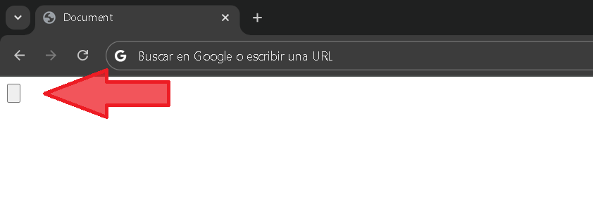

Añadiremos algún valor:

```HTML
    <input type="button" value="Aceptar">
```

Documento:

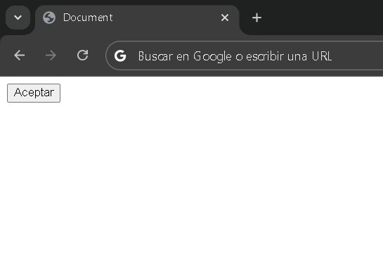

## color.

La siguiente etiqueta de `input` es la de tipo `color`.

```HTML
    <input type="color" name="colores">
```

Donde nos da la opción de poder seleccionar colores.

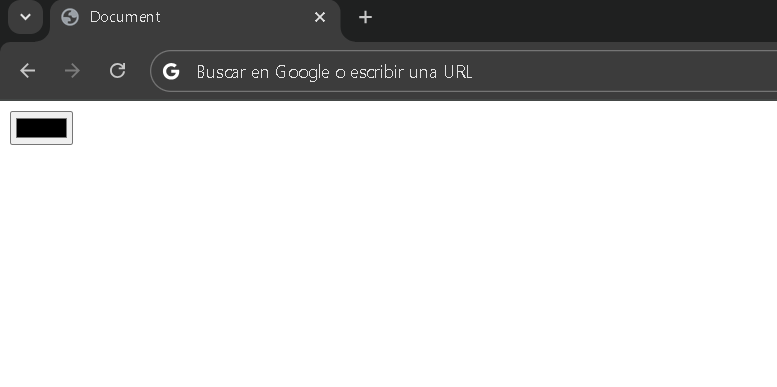

## date.

`input` de tipo `date`, sirve para seleccionar fechas.

```HTML
<input type="date" name="fecha">
```

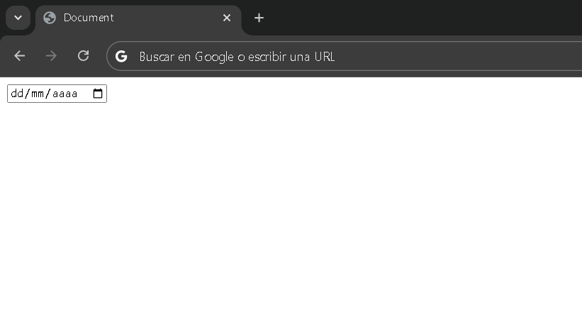

También tenemos una muy similar que es el `datetime-local`, que nos sirve para seleccionar fechas y además tiempo.

```HTML
    <input type="datetime-local" name="fechaYhora">
```

Documento:

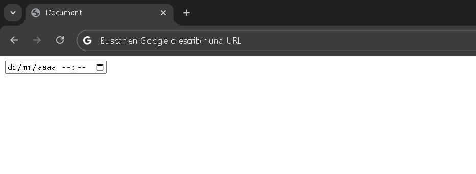

## file.

El siguiente input es el de tipo file, que nos permite seleccionar un archivo de nuestro equipo.

```HTML
<input type="file" name="archivos">
```

Documento:

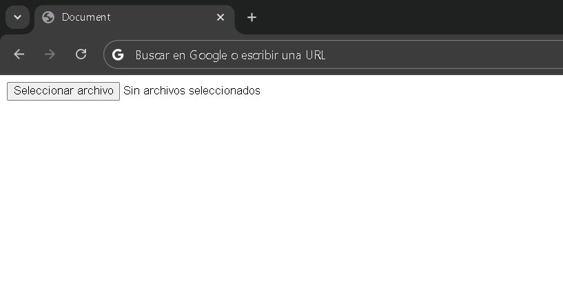

Cuando hacemos clic en *Seleccionar archivo*, nos emerge una ventana de navegación del sistema operativo.

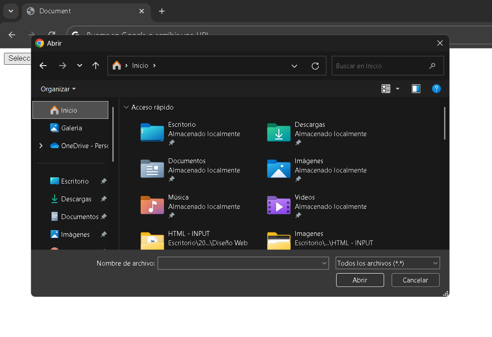

## month.

La siguiente etiqueta de `input` es la de month muy similar a la de `date`, solo que nos deja seleccionar mes y año.

```HTML
    <input type="month" name="mesYaño">
```

Documento:

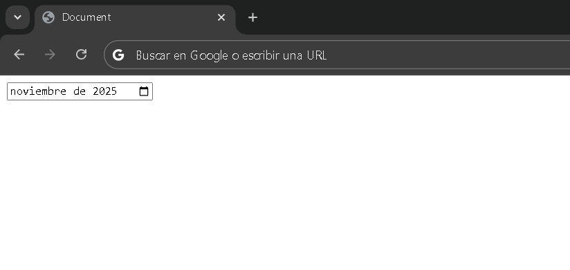

## textarea.

El elemento `textarea` en HTML se utiliza para que el usuario pueda ingresar texto en múltiples líneas, a diferencia de un `input type="text"`, que solo permite una sola línea de texto.

```HTML
<textarea name="comentario" rows="5" cols="40"></textarea>
```

Documento:

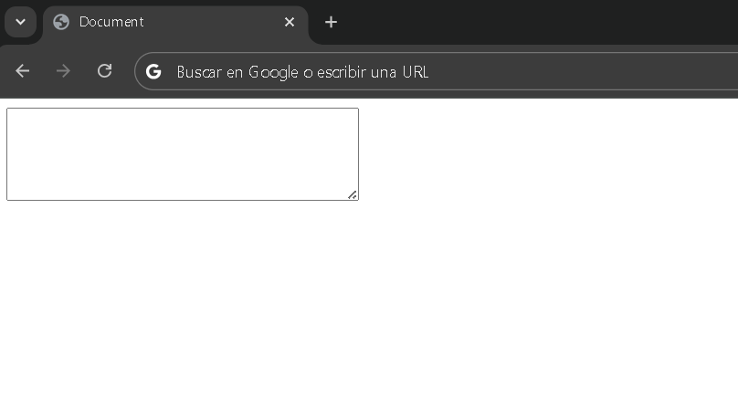


## number.

Siguiente `input` es el de `number`, este `input` solo nos permite seleccionar números.

```HTML
    <input type="number" name="numeros">
```

Documento:

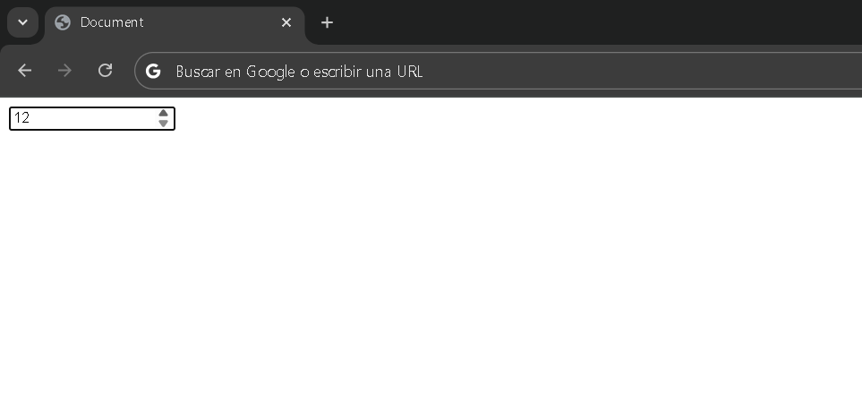

